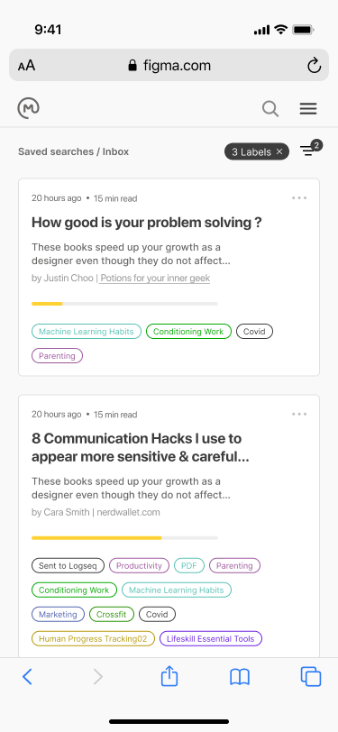
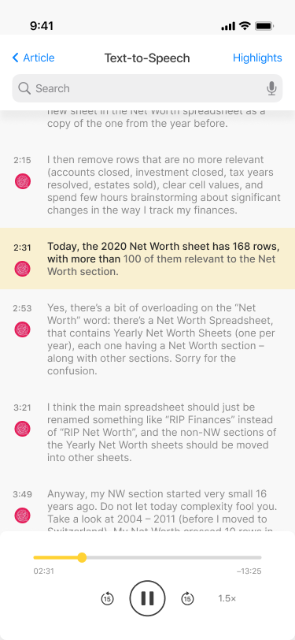
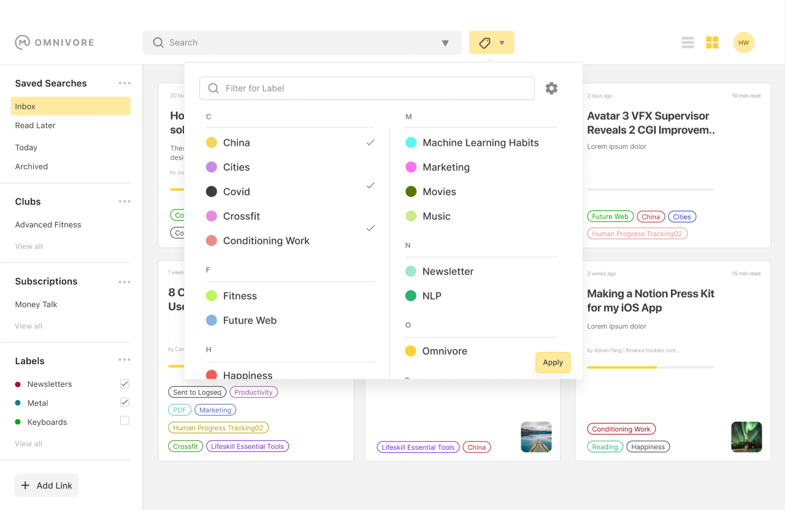
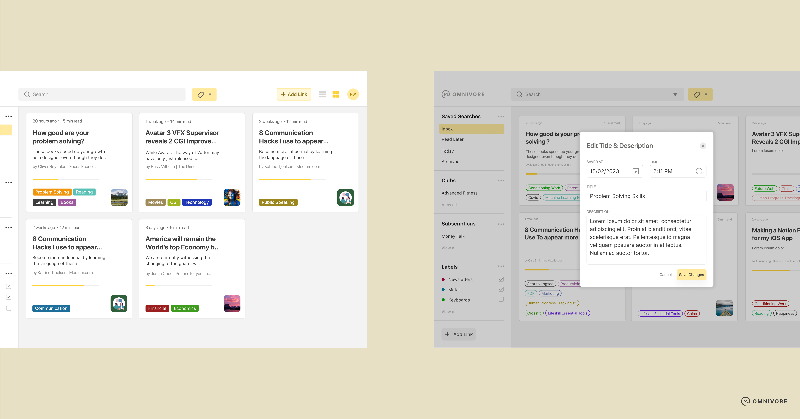
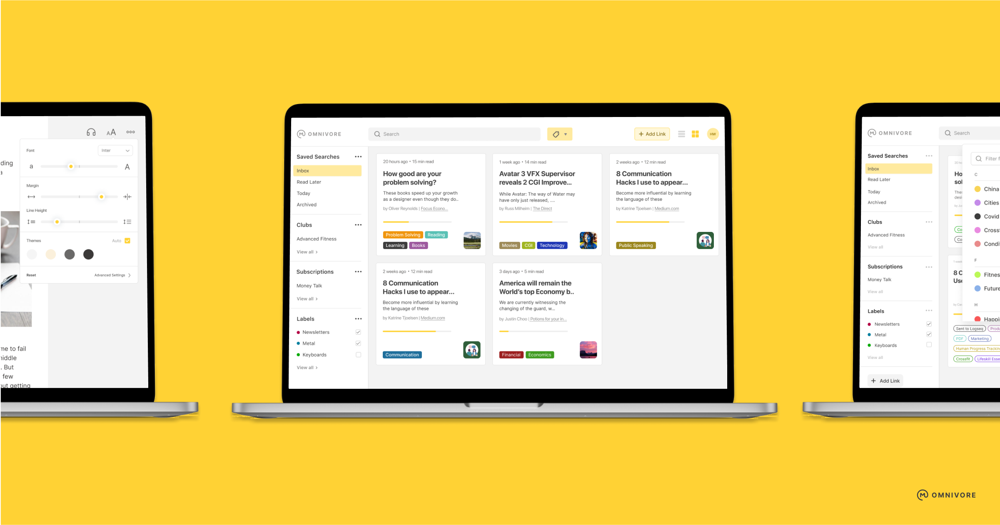
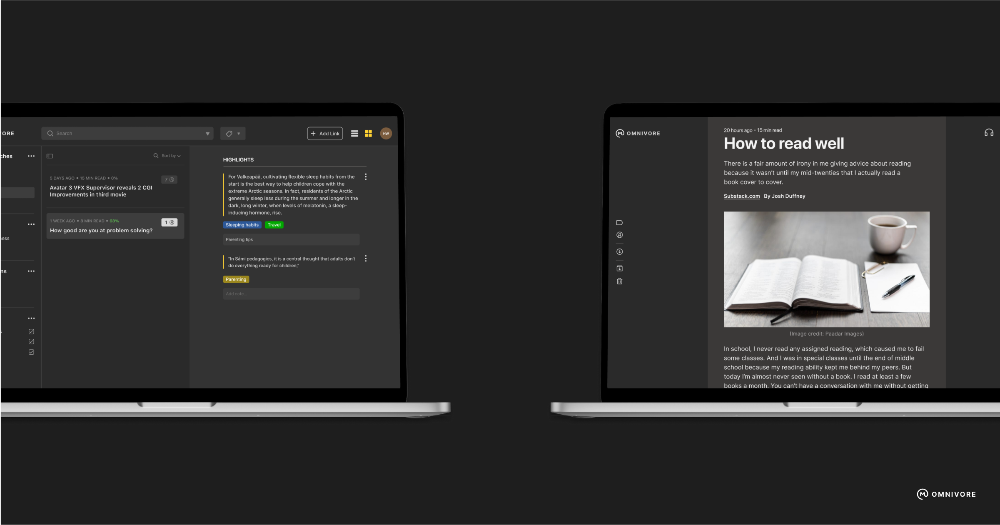
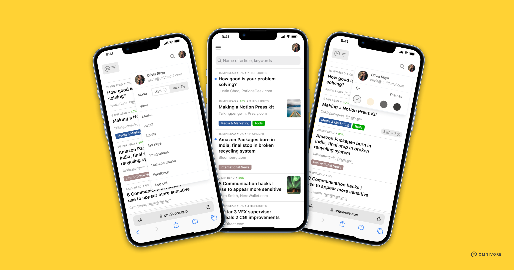
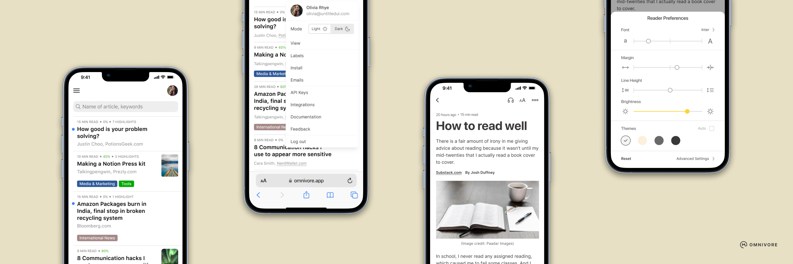
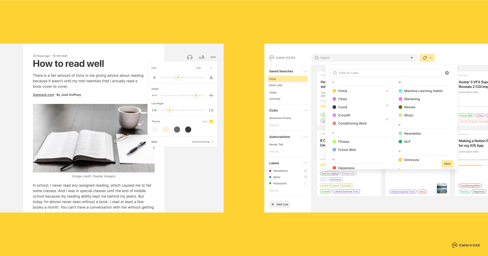

# {{ $frontmatter.title }}

[[toc]]

## About

Omnivore is a free and open-source project and an open community. Our mission is to make everyone enjoy reading.

Omnivore is built by a small distributed team of developers based in San Francisco and Singapore.

## Feature List

Power user's like to save articles, PDFs, and newsletters to Omnivore to read later. In the Omnivore Library they are able to organize all their saved reading, using tags, full-text-search, and filters. In the Omnivore Reader they enjoy distraction free reading, where cruft like ads and other nonsense are removed from their articles. The reader allows them to highlight and add notes, which are stored in Omnivore's Notebooks. Finally, all their reading, highlighting, and notes can be synced into popular Personal Knowledge Management systems like Logseq and Obsidian.

- Highlighting, notes, search, and sharing
- Full keyboard navigation
- Automatically saves your place in long articles
- Add newsletter articles via email (with substack support!)
- PDF support
- Web app written in Node.js and TypeScript
- Native iOS app
- Native Android app
- Progressive web app
- Browser extensions for Chrome, Safari, Firefox, and Edge
- Labels (aka tagging)
- Offline support for iOS, and Android
- Text to speech (iOS only)
- Logseq support via our Logseq Plugin
- Obsidian support via our Obsidian Plugin

## Screenshots and Graphics

If you need higher resolution versions of any of these graphics, or any other assistance, please contact us at [feedback@omnivore.app](mailto:feedback@omnivore.app).

## Logo

Omnivore Logo

## iOS Screenshots

Omnivore's Library UI on iPhone

Omnivore's Text to Speech UI on iPhone

Omnivore's Reader UI on iPhone

## Browser Screenshots

Omnivore's Reader UI with a Dark theme

Omnivore's Reader UI with a Light theme

Setting labels on the Web

## Feature Graphics

Omnivore's Library in Grid View

Omnivore's Library in Grid View

Omnivore's Library in Grid View

Omnivore's Library in Grid View

Omnivore's Library in Grid View

Omnivore's Library in Grid View

Omnivore's Highlight View

Omnivore's Library on Mobile

Omnivore's Library on Mobile

Omnivore's Library on Mobile

Omnivore's Library on Mobile

Omnivore's Highlight View

Omnivore's Reader View

Omnivore's Reader View
