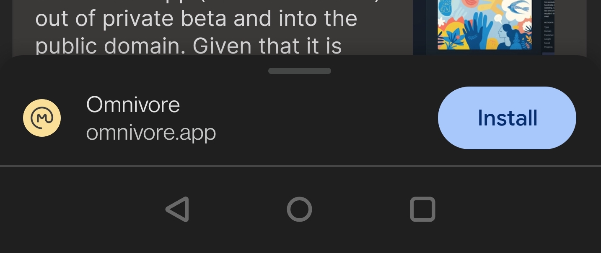

# {{ $frontmatter.title }}

[[toc]]

Omnivore ofrece extensiones de navegador y aplicaciones móviles para facilitar el guardado de enlaces.

## Browser Extensions

La extensión del navegador se utiliza para guardar páginas y URL. Con la extensión instalada, puede hacer clic en el botón de la extensión Omnivore para guardar la página actual o el menú contextual del navegador para guardar una URL. Para obtener más información sobre cómo guardar elementos, consulte nuestros documentos en [guardado](./saving.md).

- [Instalar en Chrome](https://omnivore.app/install/chrome)
- [Instalar en Edge](https://omnivore.app/install/edge)
- [Instalar en Firefox](https://omnivore.app/install/firefox)
- [Instalar en Safari](https://omnivore.app/install/safari)

## Aplicaciones Móviles

Las aplicaciones de iOS y Android se utilizan para guardar enlaces, explorar su biblioteca y leer contenido guardado.

::: aviso La aplicación de Android se encuentra en un estado de prelanzamiento y tiene una funcionalidad limitada. Recomendamos usar una combinación de la aplicación de Android y la Aplicación Web Progresiva en Android para obtener la mejor experiencia
:::

- [Instalar en iOS](https://omnivore.app/install/ios)
- [Instalar en Android](https://omnivore.app/install/android)

## Instalación de la Aplicación Web Progresiva

Después de iniciar sesión en la aplicación en Chrome en Android, verá un banner en la parte inferior de la pantalla para instalar Omnivore. Esto instalará la aplicación web progresiva en la pantalla de inicio de Android.

