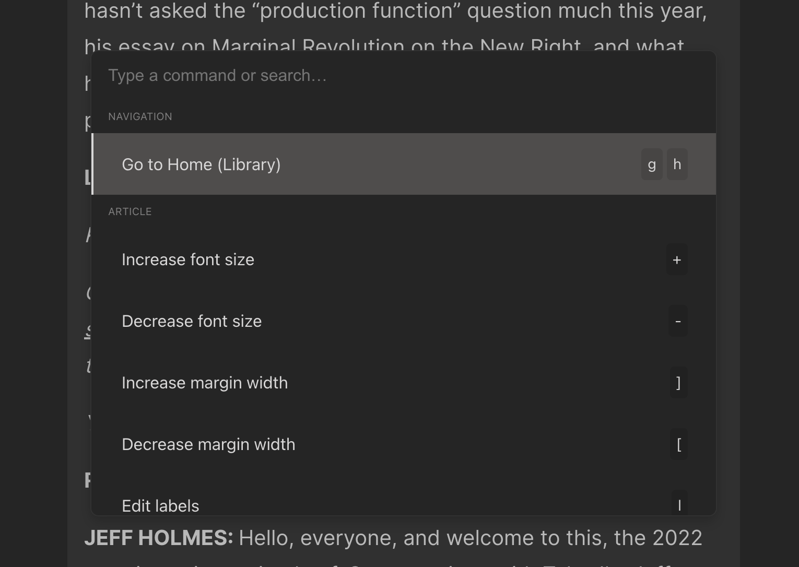

# {{ $frontmatter.title }}

[[toc]]

Todas las funciones principales del cliente web Omnivore están disponibles a través del teclado. Hay dos formas de usar el teclado dentro de Omnivore: abriendo la barra de comandos y escribiendo un nombre de comando o usando un comando de teclado directamente.

Actualmente, la funcionalidad del teclado solo está disponible en la web.

Puede ver todos los comandos de teclado disponibles tocando la tecla `?`.

## Comandos de teclado de la biblioteca

La mayoría de los comandos de la biblioteca actúan sobre el elemento seleccionado actualmente. Por ejemplo, para archivar un elemento de la biblioteca, primero lo seleccionaría y luego tocaría `e` o usaría la barra de comandos para archivar el elemento.

Para seleccionar elementos en la biblioteca, use las teclas de flecha o las teclas j y k. Si su biblioteca está en modo de cuadrícula, las teclas de flecha le permiten navegar `arriba`/`abajo` e `izquierda`/`derecha`. Las teclas `j` y `k` navegarán hacia adelante y hacia atrás.

- `enter`: abre el elemento de biblioteca seleccionado
- `o`: abre la versión original
- `l`: establecer etiquetas en el elemento seleccionado
- `e`: archivar el elemento seleccionado
- `r`: eliminar el elemento
- `shift` `i`: Marcar como leído
- `shift` `u`: Marcar como no leído

### Agregar enlaces con el teclado

Toque la tecla `a` para abrir el cuadro de diálogo Agregar enlace

### Uso del teclado con búsqueda en la biblioteca

Utilice la tecla `/` en la vista de biblioteca para iniciar una búsqueda. Para borrar su búsqueda actual, toque la tecla `x`.

## Comandos del teclado del lector

Dentro del lector, puede ajustar la configuración de visualización, los márgenes, el espacio entre líneas y el tema mediante los comandos del teclado. También puede realizar acciones en elementos, como archivar y eliminar desde la vista del lector.

### Crear resaltados

Cuando tiene texto seleccionado en la vista del lector, puede crear un resaltado tocando `h`. Si desea crear un resaltado con una nota, toque `n`.

### Cambiar la configuración de la pantalla

- `d`: abre el modal de configuración de pantalla

### Acciones de artículos

- `e`: archivar el artículo actual
- `l`: establecer etiquetas
- `o`: abre la versión original del artículo

## Moverse entre vistas usando el teclado

Puede moverse entre vistas en Omnivore usando el teclado. Para leer un elemento de la biblioteca, primero selecciónelo y luego presione Intro para abrirlo en la vista del lector. Cuando termine de leer, puede archivarlo y regresar a la biblioteca usando 'e' o use la tecla 'u' para moverse "arriba" a la biblioteca.

## Acceso a la barra de comandos

La barra de comandos le permite escribir comandos. Abra la barra de comandos con CMD+K en MacOS o CTRL+K en Windows.

