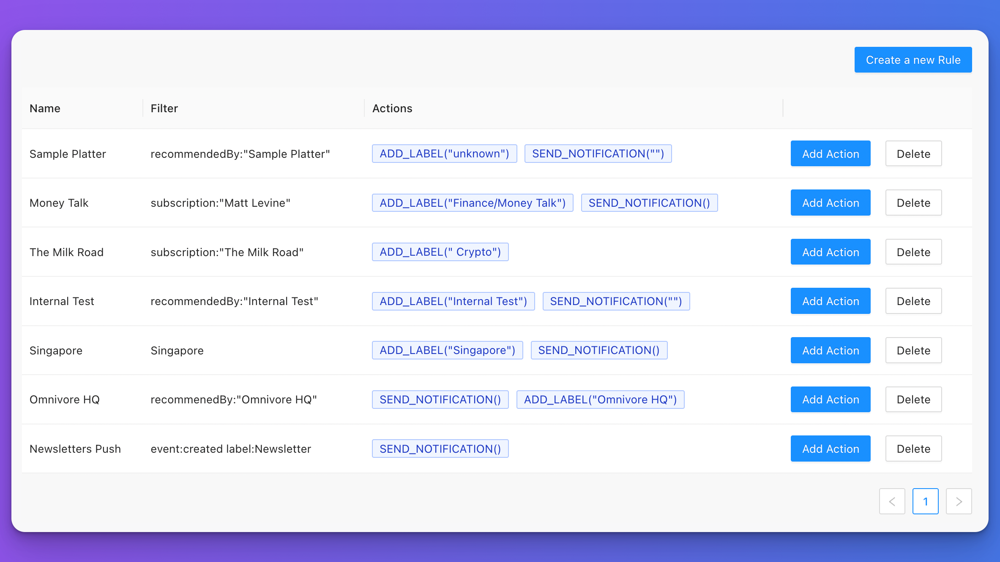

# {{ $frontmatter.title }}

[[toc]]

## Introduction

::: aviso Las reglas son una característica beta y actualmente solo están disponibles en la web. La sintaxis de las reglas puede cambiar en el futuro y romper la compatibilidad con versiones anteriores
:::

Por debajo, Omnivore usa un motor de reglas para implementar funciones de alto nivel. Las reglas se aplican cuando se crea o modifica un artículo.

Una regla es una combinación de un filtro de búsqueda y un conjunto de acciones. Cuando una página coincida con el filtro de búsqueda, se aplicarán las acciones. Por ejemplo:

- `subscription:"Money Talk"` -> `Add Label('Finance')`: Esta regla agrega la etiqueta Finance a todas las páginas que provienen de la suscripción `Money Talk`.

## Creación de Reglas

Actualmente, las reglas solo se pueden crear en la página [/settings/rules](https://omnivore.app/settings/rules). Para crear una nueva regla:

- Toque el botón `Crear una nueva regla` en la parte superior derecha
- Introduzca un filtro de búsqueda. Utilice la referencia [buscar](./search.md) para obtener más información
- Seleccione las acciones que le gustaría aplicar cuando la regla coincida

## El Objeto Evento

Los filtros de búsqueda para reglas son ligeramente diferentes a los filtros de búsqueda regulares. Junto con toda la funcionalidad normal de [búsqueda avanzada](./search.md), las reglas tienen un objeto evento. El objeto evento le permite crear reglas que coincidan con ciertos eventos.

- `event.created`: La regla solo coincidirá cuando la página se guarde por primera vez.
- `event.updated`: La regla se activará cuando se modifique cualquier parte de las propiedades de una página. Por ejemplo, se agrega una etiqueta, se cambia el título o se actualiza la posición de lectura.

## Acciones

- `Add Label`: Agrega un conjunto de etiquetas a un artículo
- `Send Notification`: Envía una notificación automática a los dispositivos iOS registrados
- `Archive`: Archiva un artículo

## Algunas ideas de reglas

- `is:read` -> `Archive()`: Archivar automáticamente un artículo una vez leído por completo
- `Text word` -> `Add Label('some label')`: Agregue automáticamente una etiqueta a una página si contiene una palabra específica. Por ejemplo `Vancouver Canucks` -> `Add Label('Hockey')`
- `event.created label:Newsletter` -> `Send Notification()`: Envíe una notificación push cada vez que se entregue un boletín informativo.
