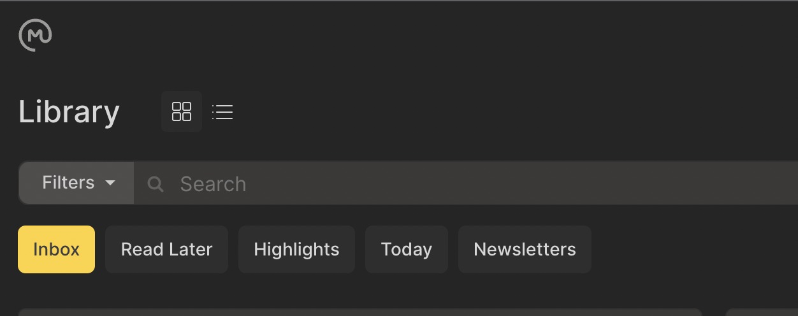

# {{ $frontmatter.title }}

[[toc]]

Utilice el menú Búsquedas guardadas para refinar la vista de su biblioteca (algunos filtros pueden estar visibles de forma predeterminada).

- Seleccione `Read Later` para ver una lista de todos sus enlaces no archivados excepto Newsletters.

- Seleccione`Highlights` para ver las selecciones de texto que ha resaltado en todas sus páginas guardadas.

- Seleccione `Today` para ver una lista de enlaces que guardó hoy.

- Seleccione `Newsletters` para ver los enlaces guardados a través de sus suscripciones a Newsletters.

## Acceso a búsquedas guardadas en iOS

- Toque el botón desplegable en la parte superior izquierda de la biblioteca. El botón Búsquedas guardadas muestra la búsqueda guardada actualmente activa. Por defecto, esta es `Bandeja de entrada`.

## Acceso a búsquedas guardadas en la Web

- Elija la búsqueda guardada que le gustaría usar de los botones de cinta en la parte superior de la biblioteca. La búsqueda activa se muestra en amarillo. Por defecto, esta es `Bandeja de entrada`

