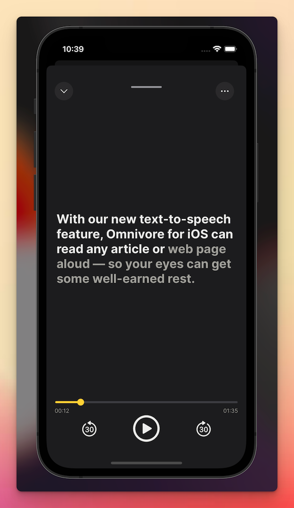
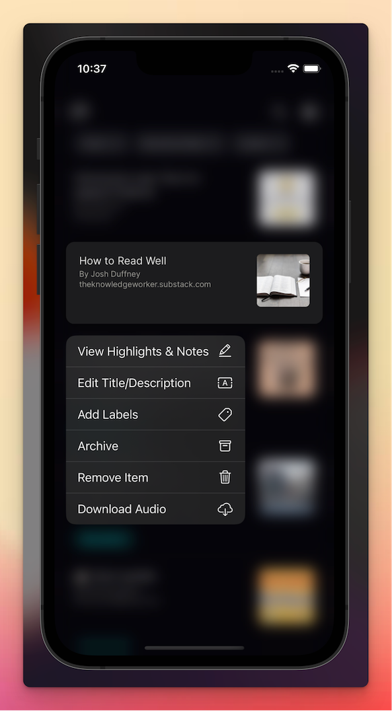

# {{ $frontmatter.title }}

Omnivore para iOS puede leer cualquier artículo o página web en voz alta, para que sus ojos puedan descansar un poco.

[[toc]]

## Haga que los artículos se lean en voz alta con Texto a Voz

::: consejo Texto-a-Voz actualmente sólo está disponible en la aplicación Omnivore para iOS.
:::

Así es como funciona:

- Guarde cualquier artículo en Omnivore.
- Inicie la aplicación Omnivore y toque un elemento guardado en su Biblioteca para abrir el lector.
- Toque el botón Escuchar (el icono de los auriculares en la parte superior) para iniciar la reproducción en modo de pantalla completa.

Puede seguir el texto mientras se lee en voz alta. Deslice el dedo hacia la izquierda o hacia la derecha para saltar hacia atrás o hacia adelante.

- Toque la flecha hacia abajo o deslícese hacia abajo desde la parte superior para usar el modo de minireproductor.
- Toque el icono (tres puntos) para acceder a controles de reproducción adicionales.

## Descargr el audio para reproducción sin conexión

Desde la vista de la Biblioteca, mantenga presionado cualquier elemento y elija Descargar Audio. Esto descargará una versión sin conexión del artículo que se puede reproducir más tarde.

## Demostración

<iframe width="560" height="315" src="https://www.youtube.com/embed/wyy1vC-e338" title="YouTube video player" frameborder="0" allow="accelerometer; autoplay; clipboard-write; encrypted-media; gyroscope; picture-in-picture; web-share" allowfullscreen></iframe>
