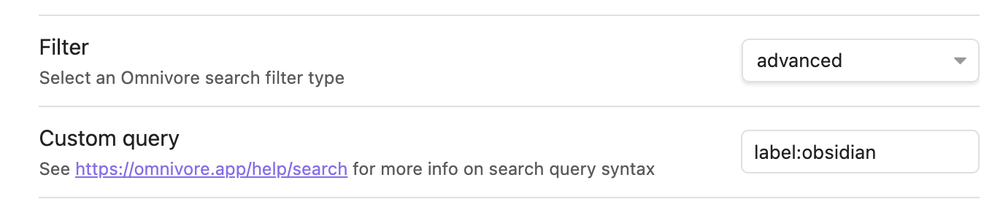

# {{ $frontmatter.title }}

Omnivore integrates with Obsidian via the [obsidian-omnivore](https://github.com/omnivore-app/obsidian-omnivore) plugin. The plugin allows for customizing the data synced from Omnivore to Obsidian and controlling the layout of the data.

[[toc]]

## Features

* Import your highlights and saved articles
* Create graphs based on Omnivore data
* Filter imported data using Omnivore's [advanced search syntax](https://omnivore.app/help/search)
* Custom templates for imported data

## Installation

1. Install and enable the plugin from the Community Plugins section of Obsidian or [build it from source](https://github.com/omnivore-app/obsidian-omnivore) and load the unpacked plugin.
2. Sign up for an [Omnivore account](https://omnivore.app).
3. Go to [Omnivore](https://omnivore.app/settings/api) and create an API key.
4. Open the Omnivore plugin settings in Obsidian and add your API key.
5. Run Omnivore sync by opening the command palette (Ctrl + P or CMD + P). Type Omnivore and select the option **Omnivore: Sync**.

## Customizing which data is synced from Omnivore to Obsidian

When you sync your data from Omnivore to Obsidian, you can choose which data you want to sync. You can filter the data based on the folder, the labels attached to the item, and etc.

### Custom Query

The Omnivore Obsidian plugin allows you to use Omnivore's [advanced search syntax](../using/search) to filter the data you want to sync from Omnivore to Obsidian. You can enter a custom query in the plugin settings under **Custom Query**. For example, if you want to sync only the items tagged with `Obsidian`, you can enter `in:all label:Obsidian` in the Custom Query.

### Filter



The Omnivore Obsidian plugin also offers four easy options for which data is synced from Omnivore to Obsidian. You can select one of the following options in the plugin settings under **Filter**:

* Sync all the items: This will sync every item from Omnivore including the labels (tags), highlights, and notes you have added to the item.
* Sync only the library items: This will sync every item in you library folder from Omnivore.
* Sync only the archived items: This will sync every archived item from Omnivore.
* Sync only the highlighted items: This will sync every highlighted item from Omnivore.

::: warning
Changing the filter will automatically update **Custom Query** to reflect the new filter.
:::

## Controlling the layout of the data imported to Obsidian

The Omnivore Obsidian plugin uses the [mustache](https://mustache.github.io/) template language to define how imported data is saved to Obsidian. The plugin settings allow you to define the template for an article layout. The default templates will be used if you do not define your own.

### Mustache template language

Mustache is a simple and logic-less templating language that allows you to create templates that are easy to read and maintain. Mustache templates consist of tags, which are placeholders that are replaced with actual values when the template is rendered.

There are several types of Mustache tags, including:

::: v-pre

* `{{ variable }}`: Renders the value of a variable.
* `{{# section }}` ... `{{/ section }}`: Renders a section of the template if the value of the section is true, such as an array or an object.
* `{{^ inverted section }}` ... `{{/ inverted section }}`: Renders a section of the template if the value of the section is false.
* `{{! comment }}`: Adds a comment to the template, which is ignored when the template is rendered.

In addition to the basic Mustache tags, there are also several built-in Mustache functions that you can use in your templates, such as:

* `{{# list }}` ... `{{/ list }}`: Renders a section of the template for each item in a list.
* `{{^ emptyList }}` ... `{{/ emptyList }}`: Renders a section of the template if a list is not empty.
* `{{& variable }}` or `{{{ variable }}}`: Renders the value of a variable without escaping HTML characters.
* `{{> partial }}`: Renders a partial template, which is a reusable template that can be included in other templates.
:::

### Variables available in the article template {#variables-available-in-the-template}

* id: The id of the article. This will be used as the id of the file in frontmatter
* title: The title of the article
* omnivoreUrl: The URL of the article in Omnivore
* siteName: The name of the site the article was saved from
* originalUrl: The URL of the original article. If the article was created from an emailed binary (eg PDF) attachment, this URL will reference the attachment and will not be accessible.
* author: The author of the article
* dateSaved: The date the article was saved to Omnivore in your perferrred date format
* description: The description of the article
* content: The content of the article in Markdown format. This may be empty if the article was created from an emailed binary (eg PDF) attachment.
* labels: A list of labels attached to the page
  * name: The name of the label, for example `Newsletter`
* note: The note attached to the article
* type: The type of page, for example `ARTICLE` or `FILE`
* datePublished: The date the article was published in your perferrred date format
* dateRead: The date the article was read in your perferrred date format
* dateArchived: The date the article was archived in your perferrred date format
* fileAttachment: The file attachment attached to the article
* state: The state of the article, for example `READING` or `COMPLETED`
* wordsCount: The number of words in the article
* readLength: The length of time it took to read the article in minutes
* highlights: A list of highlights attached to the article
  * text: The text of the highlight
  * highlightUrl: The URL of the highlight in Omnivore
  * labels: A list of labels attached to the highlight
    * name: The name of the label, for example `Newsletter`
  * note: The note attached to the highlight
  * dateHighlighted: The date the highlight was created in your perferrred date format
  * highlightID: The uuid of the highlight
  * color: The color of the highlight, for example `yellow`
  * positionPercent: The position of the highlight in the article as a percentage
  * positionAnchorIndex: The position of the highlight in the article as an index/page number

Default template:

```
# {{{title}}}
#Omnivore

[Read on Omnivore]({{{omnivoreUrl}}})
[Read Original]({{{originalUrl}}})

{{#highlights.length}}
## Highlights

{{#highlights}}
> {{{text}}} [⤴️]({{{highlightUrl}}}) {{#labels}} #{{name}} {{/labels}}
{{#note}}

{{{note}}}
{{/note}}

{{/highlights}}
{{/highlights.length}}
```

### Importing the Full Article Content

::: warning Full content import does not work for PDFs
:::

The content of articles is converted to Markdown before import. This means we need them to avoid HTML
escaping when being inserted into Obsidian. To do this, use the triple Mustache syntax.
Any highlights that you have created in Omnivore will be rendered as Markdown highlights.
So to import the full article content:

```
{{{ content }}}
```

For example:

```
# {{{title}}}
#Omnivore

[Read on Omnivore]({{{omnivoreUrl}}})
[Read Original]({{{originalUrl}}})

{{{ content }}}

```

Simplified template with full content and file attachment, if it there is one.

> Note if the article was created via an emailed binary (eg PDF) attachment, `content` will be empty.

```
# {{{title}}}

{{{content}}}

{{#fileAttachment}}
---

![[{{{fileAttachment}}}]]
{{/fileAttachment}}
```

### Function map in the article template {#function-map-in-the-article-template}

::: v-pre

* lowerCase: Converts a string to lowercase
* upperCase: Converts a string to uppercase
* upperCaseFirst: Converts the first character of a string to uppercase
* formatDate: Converts a date to a different format. For example, `{{#formatDate}}{{dateSaved}},"yyyy-MM-dd"{{/formatDate}}` will convert the date to `2022-01-01`.
:::

Example of using a function in a template to convert the state of an article to lowerCase:

```
state:: [[{{#lowerCase}}{{state}}{{/lowerCase}}]]
```

### Front Matter

[While most of the text in a note is meant to be read by a human, metadata is text that's meant to be easily readable by a program, for example a community plugin or Obsidian itself.](https://help.obsidian.md/Editing+and+formatting/Metadata) The front matter includes the metadata at the top of the note in YAML format. You can enter the metadata separated by comma and you can also use custom aliases in the format of `metadata::alias`. For example, `date_saved::date` will generate `date: 2023-05-30` in the front matter.

The available metadata are in snake case:

* title
* author
* tags
* date_saved
* date_published
* omnivore_url
* site_name
* original_url
* description
* note
* type
* date_read
* words_count
* read_length
* state
* date_archived

The default metadata are `title, author, tags, date_saved, date_published`.

Please note that `id` will always be included in the front matter for the purpose of deduplication.

### Front Matter Template

The front matter template is used to override the front matter of the file. It will only be used when it is set. If it is not set, the front matter will be generated automatically based on the metadata defined in "Front Matter" section under basic settings.

The available variables are the same as the [variables in the article template](#variables-available-in-the-template).

A sample front matter template:

```
id: {{{id}}}
title: >
  {{{title}}}
{{#author}}
author: >
  {{{author}}}
{{/author}}
{{#labels.length}}
tags:
{{#labels}} - {{{name}}}
{{/labels}}
{{/labels.length}}
date_saved: {{{dateSaved}}}
{{#datePublished}}
date_published: {{{datePublished}}}
{{/datePublished}}
```

## Customizing where the data is saved in Obsidian

You can customize where the data is saved in Obsidian by defining the **Folder** and **Filename** templates in the plugin settings.

### Folder

::: v-pre
Enter a folder name for the note. You can either use a fixed folder name or a template. If you use a template, the folder name will be generated based on the template. For example, if you enter `{{{ siteName }}}`, the folder name will be the name of the site the item was saved from so that the notes are organized by site.
:::

### Filename

::: v-pre
Enter a filename for the note. You can either use a fixed filename or a template. If you use a template, the filename will be generated based on the template. For example, if you enter `{{{ title }}}`, the filename will be the title of the item.
:::

### Available variables and functions for Folder and Filename templates

The meaning and usage of each variable and function is the same as the [variables and functions in the article template](#variables-available-in-the-template) and [function map in the article template](#function-map-in-the-article-template).

#### Variables

* id
* title
* author
* siteName
* type
* dateSaved
* datePublished
* dateArchived
* dateRead

#### Functions

* lowerCase
* upperCase
* upperCaseFirst
* formatDate

### Sync all the items into a single note

By default, Omnivore will sync items into separate notes in Obsidian. If you would like to sync all your items into a single note, you can turn on the option **Is Single File** and use a fixed **Filename** in the plugin settings.

## Scheduled Sync

By default, Omnivore does not automatically sync your data. You can enable scheduled sync by entering a number of minutes in the **Frequency** setting. For example, if you enter `60`, Omnivore will sync your data every hour and you can always turn it off by entering `0`.
